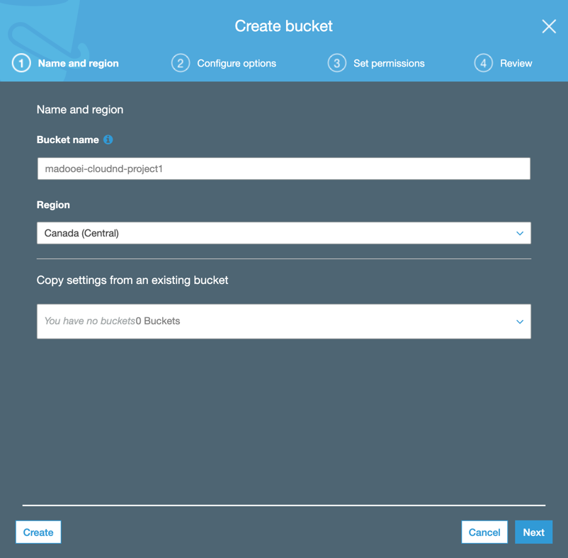
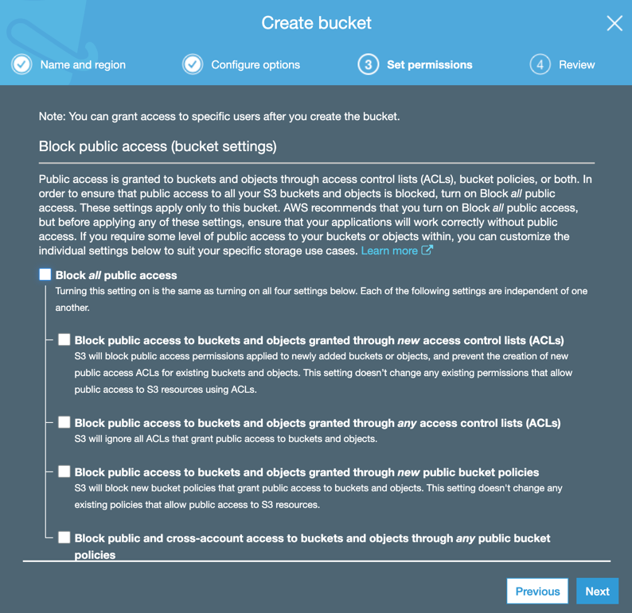
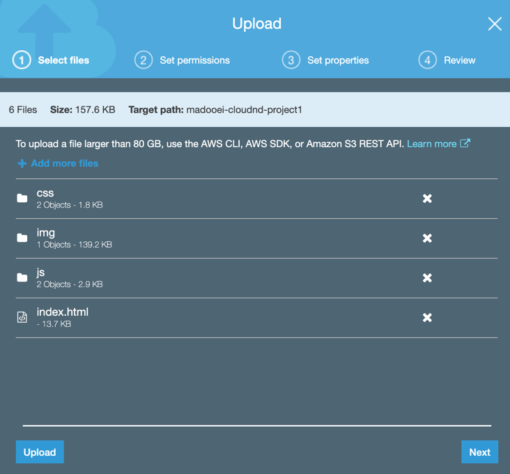
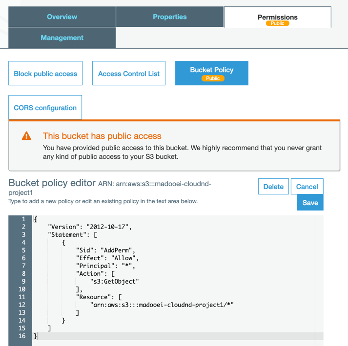
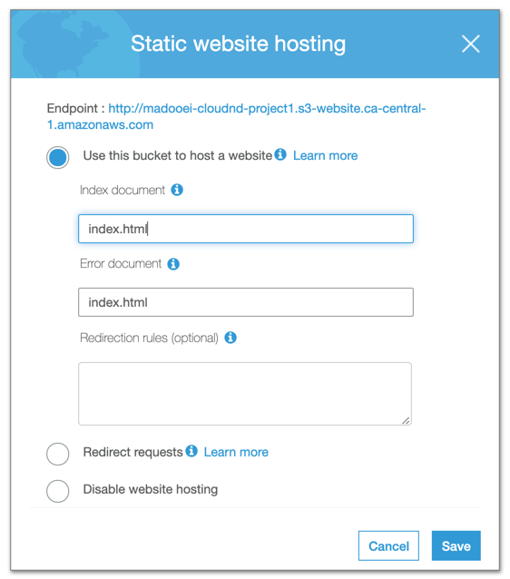
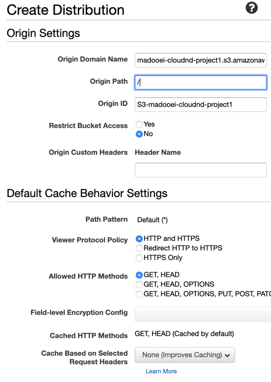

# Deploy Static Website on AWS

The following images are stored in the `assets` folder.

Please note, I didn't use the provided student-ready starter code. Instead, I've uploaded my own content. 

## Create S3 Bucket

## Upload files to S3 Bucket

## Secure Bucket via IAM

## Configure S3 Bucket

## Distribute Website via CloudFront

The website is accessible through 

* [https://d1jmktkm0kw4x0.cloudfront.net/index.html](https://d1jmktkm0kw4x0.cloudfront.net/index.html) or,
* [http://madooei-cloudnd-project1.s3.ca-central-1.amazonaws.com/index.html](http://madooei-cloudnd-project1.s3.ca-central-1.amazonaws.com/index.html)